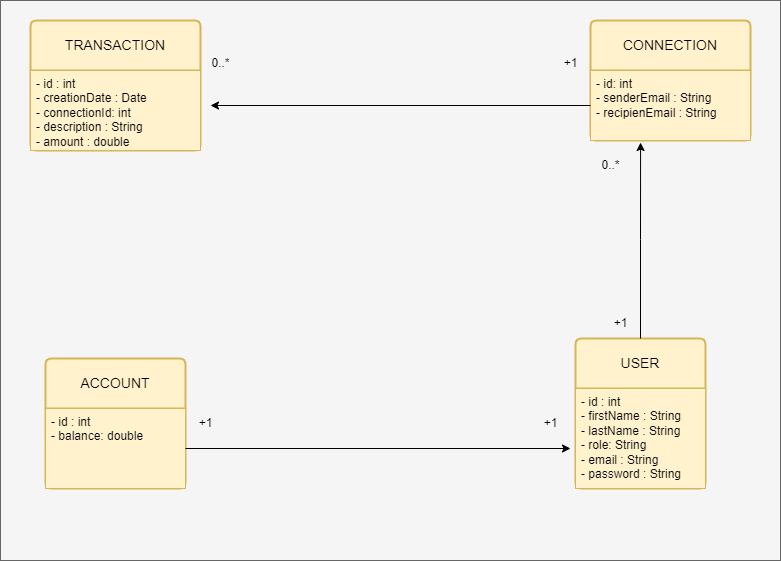
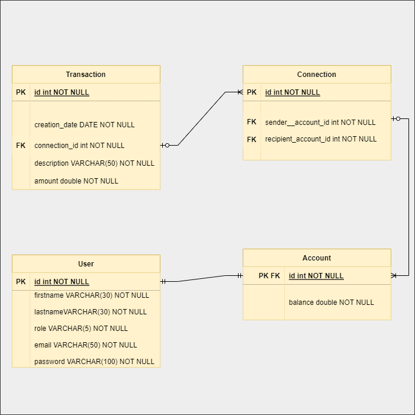

# PayMyBuddy-PM

## MCD

`Here the conceptual model of Pay My Buddy App`

## MPD

`Here is the physical model of the app`

## Launch payment platform mock

To use payment form on homepage to send money out or to use deposit, you have to launch another spring boot app.
It has just two endpoints `localhost:8082/deposit` and `localhost:8082/send-out` which sends success or failure responses.

Launch the external app : java -jar payment-platform-0.0.1-SNAPSHOT.jar

You have to use this special card number 4111111111111111, exp : 12/24, cvv : 123

